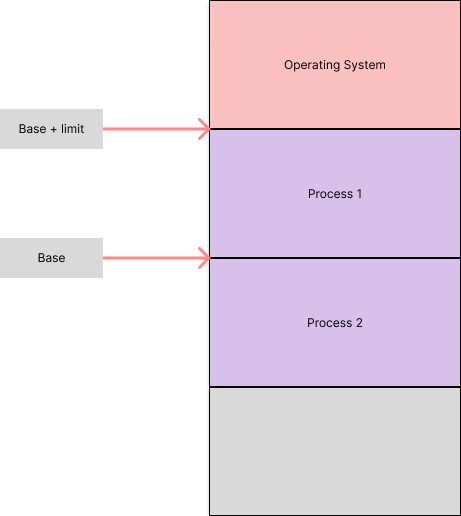

# main memory

CPU scheduling 을 통하여 여러개의 프로세스를 CPU가 효율적으로 관리하고 유저에게 빠른 응답을 제공할 수 있게 만들더라도, 프로그램들을 메모리에 올리지 못하면 좋은 성능을 기대하기 힘들다. 따라서 메모리 상에 수많은 프로그램들을 올려 놓을 수 있어야 하며, 이때 어떻게 메모리를 관리 (manage memory) 할 것인지 알아보자. 

## 메모리의 주소

메모리는 커다란 바이트들의 배열로 이루어져 있으며, 각 바이트는 메모리 주소를 가지고 있다. 메모리 주소는 0부터 시작하여 1씩 증가한다. 메모리 주소는 32비트 또는 64비트로 표현되며, 32비트의 경우 4GB(2^32 - 1)의 메모리를 표현할 수 있고, 64비트의 경우 16EB(2^64 - 1)의 메모리를 표현할 수 있다.

## CPU와 메모리의 작동 방식

CPU는 program counter의 값에 따라 메모리로부터 instruction을 가져와 실행하고, instruction은 추가적으로 특정 memory address에 값을 저장하거나, 로딩할 수 있다.

예를 들어, 전형적인 instruction-execution cycle은 다음과 같다.

1. memory로 부터 instruction을 가져온다(fetch). 
2. instruction은 디코딩되고 메모리에서 피연산자(operands)를 가져올 수 있다. 
3. instruction이 피연산자(operands)에서 실행이 된 후, 결과가 메모리에 저장된다. 

메모리 유닛은 메모리 주소의 stream만 볼 뿐, 어떻게 생성되었는지 혹은 무엇을 위한 것인지 알 수 없다.

메모리 관리에 대한 몇가지 내용을 다뤄보자.

### Basic Hardware

Main memory와 각 processing core에 탑재된 registers는 CPU가 직접 접근 할수 있는 유일한 저장장치이다. 메모리 주소를 인자로 받는 instruction이 존재하지만, disk의 주소를 받는 instruction은 존재하지 않는다. 따라서, CPU가 disk에 접근하기 위해서는 disk의 내용을 memory에 올려놓아야 한다.

각 CPU core에 내장된 register는 일반적으로 CPU clock 의 한 cycle 내에서 접근 할 수 있다. 일부 CPU core는 clock tick당 하나 이상의 작업 속도로 명령어를 decoding 하고 register 내용에 대한 간단한 작업을 수행할 수 있다. 메모리 버스의 트랜잭션을 통해 액세스되는 main memory에 대해서도 마찬가지이다. 메모리 액세스를 완료하는 데 CPU clock의 많은 cycle이 소요 될 수 있다. 이러한 경우 프로세서는 실행 중인 명령을 완료하는 데 필요한 데이터가 없기 때문에 일반적으로 정지(stall)해야 한다. 이 상황은 빈번한 메모리 액세스 때문에 견딜 수 없다. 해결책은 빠른 액세스를 위해 일반적으로 CPU 칩에 있는 CPU와 주 메모리 사이에 빠른 메모리(Cache)를 추가하는 것이다. CPU에 내장된 캐시를 관리하기 위해 하드웨어는 운영체제의 제어 없이 자동으로 메모리 액세스 속도를 향상시킨다.

physical memory에 접근하는 상대적인 속도만 고려할 것이 아니라, 정확한 operation을 보장하여야 한다. OS에 user process가 접근하는 것을 막아야 하며, 다른 user process에 접근하는 것도 막아야 한다. OS는 일반적으로 CPU와 메모리 엑세스 사이에 개입하지 않기 때문에(성능상의 이유), 이는 하드웨어에 의하여 보장되어야 한다. 한 가지 방법을 살펴보자.

위 그림과 같이, 프로세스 메모리 영역의 범위를 결정 할 수 있어야 한다. base register와 limit register 라는 두 개의 registers를 이용하여 이를 관리한다. base register는 프로세스 내부에서 유효한 physical memory address의 가장 작은 주소이며 limit register 에는 프로세스가 사용하는 메모리의 범위가 저장된다. user process 가 생성될 때 registers를 같이 생성하고, 만약 프로세스가 메모리 영역을 침범하였을때, fatal error를 발생시킨다. 

### Address Binding

일반적으로 프로그램은 disk에서 binary executable file 으로 저장되어 있고, 실행하기 위해선 프로세스라는 컨텍스트로 메모리에 올라와야 한다.

[linker and loader](./linker-and-loaders.md)

프로세스가 실행되면, 메모리의 instruction과 data에 접근할 수 있게 되며, 프로세스가 종료됐을땐 다른 프로세스가 사용할 수 있도록 메모리가 반환된다. 

대부분의 시스템에선 user process가 physical memory의 어디든 존재할 수 있다. 따라서 컴퓨터의 address space가 00000에서 시작하더라도, 프로세스의 시작 주소는 00000이 아닐 수 있다.

소스 프로그램의 주소는 일반적으로 symbolic address 이며, 컴파일러는 symbolic address를 relocatable address로 `bind` 한다( 예를 들면, 현재 모듈에서 14바이트 떨어진 곳). linker나 loader는 relocatable address를 absolute address로 변환한다(74000 + 14).

`binding` 이 어떤 방식으로 이루어 질 수 있는지 알아보자.

### Logical vs Physical Address space

CPU에 의하여 만들어진 address는 주로 logical address를 나타내는 반면 memory unit이 보는 address, 즉 메모리의 memory-address register에 load 되는 address는 physical address를 나타낸다.

compile 이나 load 과정에서 logical address와 physical address 는 같지만, execution-time의 address-binding scheme 의 결과에 따라 달라질 수 있다. 이 상황에서 logical address를 보통 virtual address라 부르지만, 혼용해서 쓰기도 한다. 한 프로그램에 의하여 생성된 logical addresses의 집합을 logical address space라 부르며 이 logical addresses 에 대응하는 physical addresses의 집합을 physical address space라 부른다. 따라서, execution-time address-binding scheme에서, logical address space와 physical address space는 서로 다를 수 있다.

실행중 virtual addresses에서 physical addresses로의 매핑은 MMU(memory-management unit)이라는 하드웨어 장치에 의해 일어난다. 다양한 방식으로 매핑을 할 수 있으며, [위에서 살펴본](#basic-hardware) base-register를 사용하는 방식이 간단히 MMU scheme 을 일반화한 것이다. 이제 base-register는 "relocation register" 라고 하자. 만일 relocation register의 값이 14000이고, user-process에서 address 346에 접근하려고 한다면, MMU는 346 + 14000 = 14346으로 변환하는 방식이다.

user program은 절대 실제 physical address에 직접 접근하지 않는다. user program은 logical address만 사용하며, MMU가 logical address를 physical address로 변환한다.

### Dynamic Loading

과거엔 프로그램 전체와 모든 데이터를 

## 메모리 관리

- 메모리는 현대의 컴퓨터 체계 운영의 핵심이며 커다란 바이트들의 배열로 이루어져 있고, 각 바이트는 메모리 주소를 가지고 있다.
- 각 프로세스에 address space를 할당하는 한 방법은 base 와 limit registers를 사용하는 것이다. base register는 프로세스의 시작 주소를 가리키고, limit register는 프로세스의 크기를 가리킨다. 
- symbolic address 와 실제 physical address를 매핑은 (1) compile, (2) load, (3) execution time에 이루어진다.
- CPU에 의해 생성된 주소는 logical address라고 알려져 있으며, 이는 MMU(memory management unit)에 의해 physical address로 변환된다.
- 메모리 할당을 하는 한가지 접근 방식은 다양한 크기의 연속 메모리 파티션을 할당하는 방식이다. 이 파티션들은 (1) first-fit, (2) best-fit, (3) worst-fit 라는 세가지 전략으로 할당 될 수 있다. 
- 현대 운영체제는 메모리 관리를 위하여 페이징(paging)을 사용한다. 페이징은 physical memory를 frame 라고 하는 고정된 크기의 블록으로 나누고, virtual memory를 page 라고 하는 고정된 크기의 블록으로 나눈다.
- 페이징이 적용될 때, logical address는 page number와 page offset라는 두가지 부분으로 나뉘어진다. page number 는 page 를 보유한 physical memory 의 frame 을 포함하는 프로세스별 페이지 테이블에 대한 인덱스 역할을 한다.(?) page offset은 frame이 참조되는 구체적인 위치를 가리킨다.
- TLB(translation look-aside buffer) 는 페이지 테이블에 대한 하드웨어의 cache 이다. 각 TLB의 entry는 page number와 그에 대응하는 frame number를 가지고 있다. 
- 페이징 시스템을 위한 address translation에서 TLB를 사용하는 것은 logical address에서 페이지 넘버를 얻기 위함도 있고, 페이지를 위한 frame가 TLB에 있는지 체크하기 위한 목적도 있다. TLB에 frame이 있다면, 여기서 frame이 얻어지고, 그렇지 않으면 page table에서 다시 찾아야 한다.
- Hierarchical paging은 logical address를 여러개로 분할하고, 각각은 다른 level의 page table을 나타낸다. address가 32bits 넘게 확장될 수 있기 때문에, hierarchial level 은 커질 수 있다. 이 문제를 해결하기 위한 두가지 전략은 (1) hashed page tables, (2) inverted page tables 이다.
- Swapping 은 시스템이 pages를 프로세스에서 disk로 옮길 수 있게 해준다.

# reference

> _Abraham Silberschatz , Greg Gagne & Peter B. Galvin (2018). Operating System Concepts (10th ed.) U.S. : willy_

_쉽게 배우는 운영체제_
