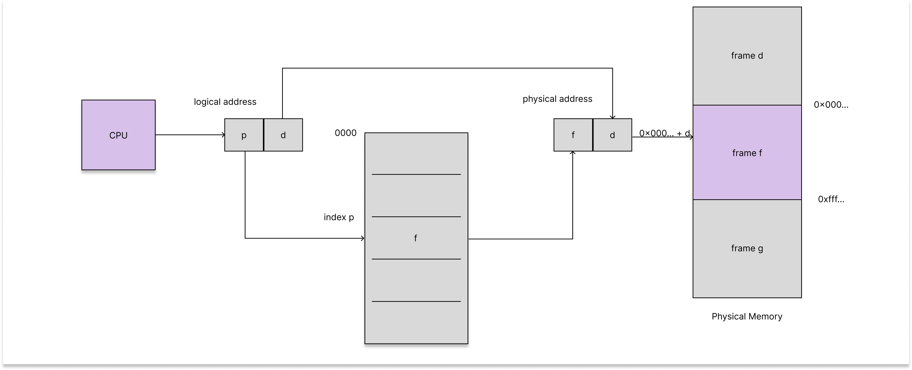
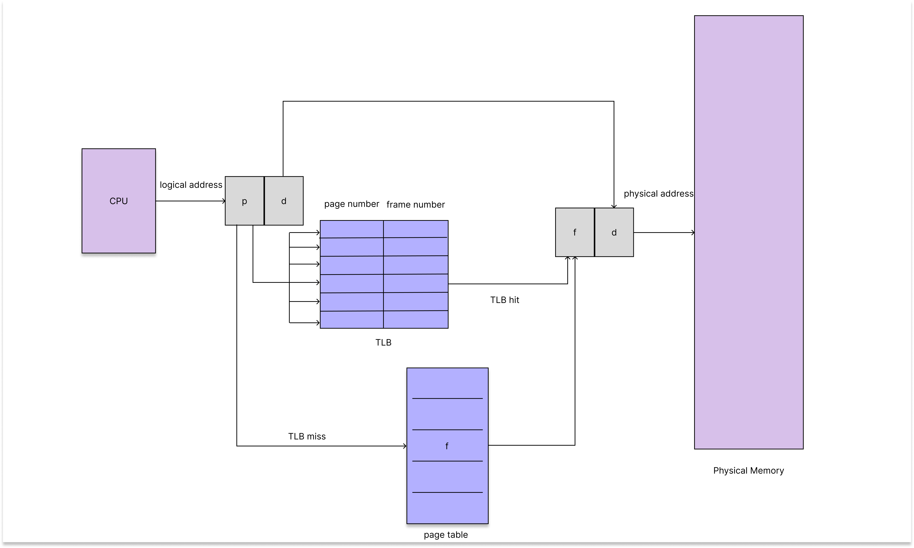

# Paging

Paging은 프로세스의 physical address space 가 연속적이지 않은 것을 허용해주는 메모리 관리 방법이다. 수많은 장점이 있기 때문에, 다양한 방식으로 현대의 운영체제에서 사용되고 있으며 하드웨어와 운영체제의 협력으로 구현된다.

## Basic Method

Paging을 구현하는 기본적인 방식은 physical memory를 "frames" 이라는 고정된 크기의 블록으로 쪼개고, logical memory를 "pages" 라는 같은 크기의 블록으로 나누는 것이다. 프로세스가 실행되면, pages 는 소유한 자원 중가용한 memory frames 에 로드된다(file system 이나 백업 저장소). 백업 저장소는 memory frames 나 여러 frames의 cluster 와 같은 고정된 크기의 블록으로 나눈다. 이러한 단순한 방식으로 큰 효과가 생긴다. 예를 들면, logical address space와 physical address space가 완전히 분리되어, 프로세스는 시스템이 2^64 바이트 이하의 physical memory를 가지고 있는데도 불구하고 logical 64-bit address space를 가질 수 있다.

CPU에 의해 생성된 모든 address는 "page number(p)" 와 "page offset(d)" 라는 두 가지 부분으로 나뉜다. 

page number 는 각 프로세스 page table 의 인덱스로 사용되고, page table 에는 각 frame 에서 physical address의 base 가 저장되어 있다. page offset 은 각 page 의 시작 주소로부터의 offset 이다. 이 두 가지 부분을 합치면, physical address 가 된다.

MMU 가 logical address 에서 physical address로 변환하는 과정은 다음과 같다.

1. page number p 를 추출하고 page table 의 p 번째 entry 에 접근한다.
2. page table 로부터 frame number f 를 얻는다.
3. logical address 의 page number p 를 frame number f 로 변환한다.

페이지의 크기는 하드웨어에 의해 정의되며, 2^n으로 정의되는데 아키텍쳐에 따라 4KB ~ 1GB 까지 변화한다. 2^n 이기 때문에 logical address 에서 page number 와 page offset 으로 변환이 쉽게 가능하다. 만약 logical address space 의 크기가 2^m 이고, page size 가 2^n 이라면, page number 는 m-n bits 로 표현되고, page offset 은 n bits 로 표현된다.

모든 logical address 는 paging hardware 에 의하여 physical address의 어딘가로 바인딩 되기 때문에, dynamic relocation 이라고 볼 수도 있으며 base(or relocation) register 의 테이블을 사용하는 방식과도 유사하다.

paging 방법을 사용하기 때문에 external fragmentation 은 발생하지 않지만 internal fragmentation 은 여전히 발생할 수 있다(page size 가 4096 이고, 프로세스의 크기가 4097 인 경우). page 사이즈를 줄이면 이 문제가 어느정도 해결되지만, page 의 크기가 클수록 성능이 좋아지는 이점도 있기에 보통 4KB ~ 8KB 의 크기를 사용하며, 운영체제에 따라 여러 page 사이즈를 지원하기도 한다.

프로세스가 실행될 때, 프로세스 사이즈는 pages 로 표현되며, 각 page 는 한 frame 을 필요로 한다. 프로세스가 n pages 를 필요로 하면, 적어도 n frames 가 가용해야 한다. 첫 page가 할당된 frame 에 로드될 때, frame 번호가 이 프로세스를 위한 page table 에 저장되고, 다음 page 가 frame에 로드될 때, page table 에 이 정보가 추가되는 방식으로 작동한다. 

프로그래머가 보는 메모리와 실제 physical memory 는 상당히 달라지는데, 이는 주소 변환 하드웨어 (address-translation hardware) 에 의해 이루어진다. logical addresses 에서 physical addresses 의 매핑은 프로그래머에게 숨겨져 있으며 운영체제에 의해 통제된다. 따라서 프로세스는 자신의 주소 영역 밖으로 나갈 수 없게 된다.

운영체제는 physical memory 에 대하여, 어느 프레임이 할당되었고 가용한지, 얼마나 많은 frames 가 존재하는지 등 많은 정보를 갖고 있어야 한다. 이는 "frame table" 이라는 하나의 시스템 자료구조에 저장되고 유지된다. frame table 에는 각 physical page frame 과 frame 이 할당된 상태인지 아닌지, 할당 되었다면 어느 프로세스에 할당 되었는지에 대한 정보가 들어있다. 게다가 운영체제는 user space 에서 운영되는 user processes 를 인지하고 모든 logical addresses 가 physical address 로 변환될 수 있도록 매핑되어야 한다. 만약 유저가 시스템 콜과 그 인자로 주소를 주면, 적절한 physical address 로 갈 수 있어야 한다. 운영체제는 각 프로세스의 page table의 복사본을 유지하는데, logical address 를 physical address 로 수동으로 매핑해야 할 때 이 복사본이 사용된다. 또한, 프로세스가 CPU 에 할당될 때 CPU dispatcher 가 hardware page table 을 정의하기 위해 사용한다. 따라서 paging 은 context-switch time 을 증가시킨다.

## Hardware Support

page table 은 프로세스 마다 갖고 있는 자료구조이기 때문에, page table 을 가리키는 포인터는 각 프로세스의 PCB 안의 어떤 register value 로 저장되어 있다. CPU 스케쥴러가 특정 프로세스를 실행하려면, 저장된 user page table에서 적절한 hardware page-table value 와 user register 를 리로드 해야한다. 속도가 빠른 hardware register 를 이용하여 page table 을 구현할 수 있지만, 이는 추가적인 컨텍스트 스위칭을 필요로 하고, 크기가 큰 page table 을 사용해야 한다면 적절치 못한 방법이다. 대신, main memory 에서 page table 을 관리하고 PTBR(page-table base register) 가 page table을 가리키게 하면, page tables 는 이 register 하나만 바꾸면 되서 컨텍스트 스위칭의 비용이 줄어든다.

### TLB(Translation Look-Aside Buffer)

PTBR 을 활용하면 컨텍스트 스위칭 면에서 더 빠르지만, main memory 의 PTBR 에서 frame number 를 찾은 뒤, frame 에 접근해야 하기 때문에 메모리 접근이 2번 일어나서 딜레이가 발생한다. 이를 해결하기 위해 특수하고, 작으며 빠른 탐색 하드웨어 캐시인 TLB(Translation Look-Aside Buffer) 를 활용한다.

TLB 는 page number 와 frame number 를 key:value 로 하는 entry로 이루어져 있다. 연관된 메모리에 item 이 제시되면, 해당 item 은 모든 key 와 동시에 비교되어 찾으면 바로 value 를 반환하는 방식이다. 최신 하드웨어는 이 instruction을 pipeline 하여 추가적인 퍼포먼스의 저하가 발생하지 않는다. 하지만 이는 TLB 가 작기 때문에 (32 ~ 1024 entries) 가능한 방식이다.

작동 방식은 다음과 같다.

1. CPU 가 logical address 를 생성하면 MMU 가 TLB 에 page number 가 있는지 확인한다. 
2. page number 가 있다면 frame number 가 즉시 사용 가능해지며, 바로 메모리에 접근한다.
3. page number 가 없다면(TLB miss) [위에서 언급한 과정](#basic-hardware)에 따라 page table 을 찾아 frame number 를 찾는다. 이후 TLB 에 page number 와 frame number 를 저장하고, 메모리에 접근한다.
4. TLB 가 이미 꽉 찼다면, 이미 존재하는 entry 중 어떤 값을 교체할지 결정해야 한다. 
   - 교체 정책은 LRU(Least Recently Used) 부터 round-robin 까지 다양하다.
   - 몇몇 TLB 에는 특정 entry 를 교체되지 않도록(wired down) 하는데, 주로 핵심 커널 코드들이 wired down 상태이다.

각 entry 에 ASID(address-space identifier) 를 가진 TLB 도 있는데, 이는 각 프로세스의 address-space 를 보호하기 위해 사용한다. TLB 가 virtual page number 를 resolve 할 때, ASID 가 일치하는지 확인한다. 일치하지 않는다면, TLB miss 로 간주한다. 이 외에도, ASID 는 서로 다른 프로세스의 entry 를 동시에 TLB에 저장될 수 있게 해준다. 이는 TLB 가 매번 page table을 선택하는 것을 방지하여 성능을 향상시킨다.
