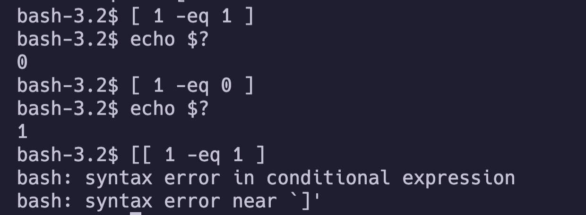

# if-else-statement

```bash
#!/bin/bash

user=`whoami`

if [[ $user == "root" ]]; then
		echo "You are root"
		exit 0
else
		echo "You are not root"
		exit 1
fi
```

```bash
#!/bin/bash

git clone non-exist-repo

if [[ $? -ne 0 ]]; then
	echo "ERROR : fail to git clone"
	exit 1
fi
```

이런 방식으로 조건문을 활용한 스크립트를 짤 수 있음

## `[` vs `[[`

위 예시에서, `[[`를 `[` 로 바꾸어도 잘 작동함. 얼핏 보면 비슷한 아이인것 같지만 매우 다름.



### `[`

- `[` 는 POSIX 표준으로 더 좋은 호환성을 지님.
- `[` 는 bash의 커멘드로 작동하며, [ expression ]에서 expression이 true 이면 0, 그렇지 않으면 1을 반환해주는 아이임.
- 끝에 오는 `]`는 그냥 `[`라는 커멘드의 마지막 인자로 와야하는 규칙일 뿐임.
- 쉘 커맨드이기 때문에 `<`, `&&` 같은 연산이 쉘 문법에 따라 작동함. (리다이렉션, 멀티커맨드)
- 적절히 escape를 해줘야 의도한 방식으로 작동할 수 있으며 syntax error가 날 가능성이 높음 (`[ ( a = a ) ]` 같은 경우) 

### `[[`

- `[[`는 conditional expression으로서 bash에서 builtin 구현된것임. (테스트 결과 대부분의 쉘(zsh, ksh, sh)에서도 비슷하게 작동함)
- `&&, ||`이 논리 연산자로 잘 작동하며 `<` 같은 경우 lexicographical comparison, `=`이나 `==`의 경우 문자열 비교를 잘 수행해줌.
- 숫자를 비교하기 위해선 `-eq` `-ne` `-gt` `-ge` `-lt` `-le` 등의 연산자를 사용해야 함.

[ \[\[ 사용법](https://www.gnu.org/software/bash/manual/html_node/Bash-Conditional-Expressions.html)

### 결론

`[`가 POSIX 표준이라 더 좋은 호환성을 가지지만, 사용하기는 `[[`이 편하고 안전함... shebang으로 실행 환경을 정해주니 `[[` 를 쓰자...!

# 참고

https://stackoverflow.com/questions/669452/are-double-square-brackets-preferable-over-single-square-brackets-in-b

https://www.gnu.org/software/bash/manual/html_node/Bash-Conditional-Expressions.html
